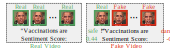

# Localized Audio Visual DeepFake Dataset (LAV-DF)

<div align="center">
    
    <p></p>
</div>

<div align="center">
    <a href="https://github.com/ControlNet/LAV-DF/issues">
        
    </a>
    <a href="https://github.com/ControlNet/LAV-DF/network/members">
        
    </a>
    <a href="https://github.com/ControlNet/LAV-DF/stargazers">
        
    </a>
    <a href="https://github.com/ControlNet/LAV-DF/blob/master/LICENSE">
        
    </a>
    <a href="https://arxiv.org/abs/2204.06228">
        
    </a>
    <a href="https://paperswithcode.com/sota/temporal-forgery-localization-on-lav-df?p=do-you-really-mean-that-content-driven-audio">
        
    </a>
</div>

This repo is the official PyTorch implementation for the paper [Do You Really Mean That? Content Driven Audio-Visual 
Deepfake Dataset and Multimodal Method for Temporal Forgery Localization](https://ieeexplore.ieee.org/document/10034605)
(Best Award).

## LAV-DF Dataset

### Download

To use this LAV-DF dataset, you should agree the [terms and conditions](https://github.com/ControlNet/LAV-DF/blob/master/TERMS_AND_CONDITIONS.md).

Download link: [Google Drive](https://drive.google.com/file/d/1-OQ-NDtdEyqHNLaZU1Lt9Upk5wVqfYJw/view?usp=sharing).

### Baseline Benchmark

| Method | AP@0.5 | AP@0.75 | AP@0.95 | AR@100 | AR@50 | AR@20 | AR@10 |
|--------|--------|---------|---------|--------|-------|-------|-------|
| BA-TFD | 79.15  | 38.57   | 00.24   | 67.03  | 64.18 | 60.89 | 58.51 |

Please note this result is slightly better than the one reported in the paper. 
This is because we have used the better hyperparameters in this repository.

## Baseline Model BA-TFD

### Requirements

The main versions are,
- Python >= 3.7, < 3.11
- PyTorch >= 1.9.0
- pytorch_lightning == 1.7.*

Run the following command to install the required packages.

```bash
pip install -r requirements.txt
```

### Training

Train the code with default hyperparameter on LAV-DF dataset.

```bash
python train.py \
  --config ./config/default.toml \
  --data_root <DATASET_PATH> \
  --batch_size 4 --num_workers 8 --gpus 1 --precision 16
```

The checkpoint will be saved in `ckpt` directory, and the tensorboard log will be saved in `lighntning_logs` directory.

### Evaluation

Please run the following command to evaluate the model with the checkpoint saved in `ckpt` directory.

Besides, you can also download the pretrained model from [GitHub Release](https://github.com/ControlNet/LAV-DF/releases/download/pretrained_model/baftd_default.ckpt).

```bash
python evaluate.py \
  --config ./config/default.toml \
  --data_root <DATASET_PATH> \
  --checkpoint <CHECKPOINT_PATH>
```

In the script, there will be a temporal inference results generated in `output` directory, and the AP and AR scores will
be printed in the console.

## References

If you find this work useful in your research, please cite it.

```bibtex
@inproceedings{cai2022you,
  title={Do You Really Mean That? Content Driven Audio-Visual Deepfake Dataset and Multimodal Method for Temporal Forgery Localization},
  author={Cai, Zhixi and Stefanov, Kalin and Dhall, Abhinav and Hayat, Munawar},
  booktitle={2022 International Conference on Digital Image Computing: Techniques and Applications (DICTA)},
  year={2022},
  doi={10.1109/DICTA56598.2022.10034605},
  pages={1--10},
  address = {Sydney, Australia},
}
```

## Acknowledgements

Some code related to boundary matching mechanism is borrowed from 
[JJBOY/BMN-Boundary-Matching-Network](https://github.com/JJBOY/BMN-Boundary-Matching-Network).
